# MicroFire Atlas

**From NASA flame data to mission-relevant fire-safety evidence.**

Live: **https://microfire-atlas.vercel.app**. Built for the NASA Space Apps Challenge 2026, *Flame in Freefall*.

[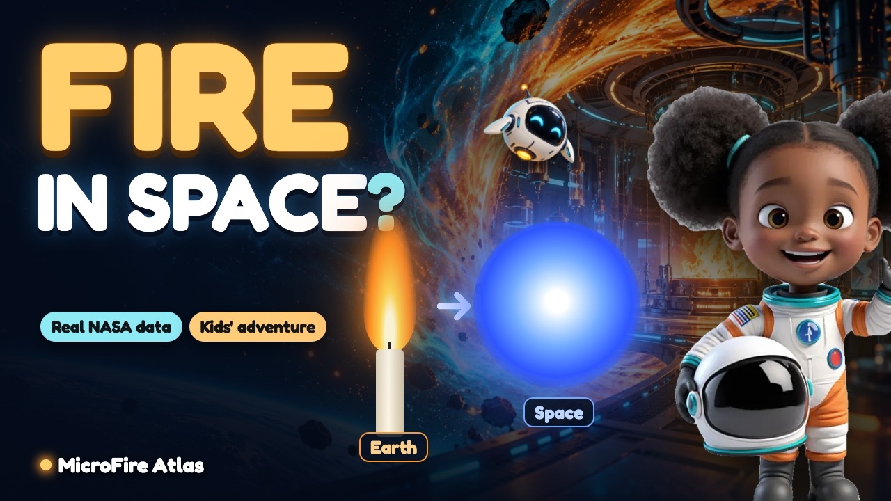](https://www.youtube.com/watch?v=T9LLWsoYPws)

▶ **Watch the 3-minute film:** https://www.youtube.com/watch?v=T9LLWsoYPws

## Contents

[Quick start](#quick-start) · [Project map](#project-map) · [Contributing](#contributing) · [60-second demo](#60-second-challenge-demo) · [FLARE-X tracker](#flare-x-gap-tracker-and-change-log) · [What we implemented](#what-we-implemented) · [NASA data used](#nasa-data-used) · [Where AI is used](#where-ai-is-used) · [Limitations](#limitations) · [Security](#security)

## In one paragraph

MicroFire Atlas turns NASA's microgravity fire tests into mission-relevant evidence. Ask what NASA knows about a material under a future lunar-habitat scenario. It finds the records across BASS, Saffire and LUCI, compares conditions, and ranks experiments and verified findings separately. It interprets one observation within its limits, checks every AI claim, and names the untested combination. It never gives a safety rating or a probability. It shows both what NASA knows and where the evidence stops.

## 60-second challenge demo

Open **[/challenge](https://microfire-atlas.vercel.app/challenge)**. One question, *"What does NASA actually know about PMMA fire under a future lunar-habitat scenario?"*, answered in nine computed stages. Each stage maps to a word in the challenge brief.

| Time | Stage | What you see |
|---|---|---|
| 0–10 s | **1 Find** | The evidence families searched, and the role each can play: structured test records (BASS-II, Saffire, LUCI), verified findings, mechanism only (FLEX, ACME), planned with no results (FM²). |
| 10–20 s | **2 Compare** | The three closest test records, condition by condition: match, near, different or not reported. |
| 20–30 s | **3 Summarize · 4 Rank** | The top NASA findings, quoted word for word with their pages. Experiments and findings are ranked separately; every rank lists what matched and what did not, with its stability across weight variations. |
| 30–40 s | **5 Interpret · 6 AI** | One bounded fire-safety implication from a reviewed template, then the AI pipeline. Evidence is retrieved first, and each claim check is computed by the live checker. |
| 40–50 s | **7 Gap · 8 Next** | Condition by condition: material, gravity, pressure and airflow were each tested somewhere, but no record reaches 34 % oxygen and none combines them. The matched-condition research question follows. |
| 50–60 s | **MicroFire says no · 9 Traceability** | Asked for a probability, MicroFire refuses and shows the closest evidence, the mismatches and what is unknown. Each challenge verb links to the page that does it. |

Switch to the alternate exploration atmosphere (66.2 kPa / 28.5 %) with the toggle at the top. Neither atmosphere is called "the Moon atmosphere": both are NASA-studied configurations used here as research scenarios.

## Research impact layer

Mission question → evidence → gap → shared-gap registry → Evidence Gain Planner.

MicroFire compares missing conditions across a finite registry of existing mission presets and Research Frontier questions. The board exposes separate question breadth, direct/analogous support, family coverage, missing dimensions and planned NASA overlap. The Evidence Gain Planner reports which registered gaps could gain matched-condition coverage if a valid experiment at a candidate's conditions existed. These are transparent coverage heuristics, not NASA priorities or predicted outcomes. Exact duplicate questions do not inflate counts, and similar physical conditions are not merged.

Open `/gaps#research-planning`, or follow the research-landscape link in Challenge Mode's final research-question stage. Unknown geometry, scale, duration and platform constraints stay visible. Hypothetical candidates have no NASA record identity or measured outcomes; FM² plans remain planned. Five versioned exports are available under `/downloads/`: `mission-scenarios.json`, `gap-registry.json`, `candidate-experiments.json`, `evidence-gain.json`, and `research-planning-graph.json`. Each includes deterministic corpus/source-manifest hashes and limitations.

The research methodology is documented on `/methodology#research-planning-method`; core checks run with `node --test lib/research-planning.test.ts` from `apps/web`. A pilot usability evaluation kit contains tasks, an empty participant template and descriptive analysis. **No human impact study has been run and no performance improvement is claimed.**

## Quick start

```bash
git clone <repo-url> && cd MicroFire-Atlas/apps/web
npm install && npm run dev      # http://localhost:3000
npm test && npm run typecheck   # same checks CI runs
```

No API key is needed. Add `OPENAI_API_KEY` or `ANTHROPIC_API_KEY` to `apps/web/.env.local` only to enable AI answers on `/ask`. Data pipelines (Python 3.12) are described under [Run it](#run-it).

## Project map

| Path | What it holds |
|---|---|
| `apps/web/app/` | Routes (`/explore`, `/ask`, `/atlas`, `/challenge`, …) |
| `apps/web/components/` | UI components |
| `apps/web/lib/` | Deterministic logic (ranking, search, gaps, ladder), each with a `*.test.ts` |
| `data/curated/` | Hand-entered, cited NASA records and findings |
| `data/processed/` | Generated model, gap and next-test outputs |
| `pipelines/` | Python build, training and vision scripts |
| `tests/` | Python tests (`test_build_dataset` needs the NASA PDFs) |
| `docs/` | Add-data guide, demo script, changelogs, screenshots |

## Contributing

Contributions are welcome, including small ones. Start with [CONTRIBUTING.md](CONTRIBUTING.md): five-minute setup, good first tasks (add a cited NASA test row, improve a test, fix accessibility) and the integrity rules (never invent data, always cite, no safety scores). Please follow the [Code of Conduct](CODE_OF_CONDUCT.md). Issue and pull-request templates are in `.github/`, and CI runs the typecheck and tests on every pull request.

## What problem it solves

NASA has studied fire in microgravity for decades, but the results are spread across test tables, figures and reports. A crew-safety researcher or mission planner cannot quickly ask: *"For this material and this cabin atmosphere, what did NASA actually observe, and how sure can we be?"*

MicroFire Atlas puts NASA's microgravity fire tests on one map, test by test. It ranks them against a mission scenario and compares outcomes. It also shows where the evidence runs out.

## Why microgravity fire matters

On Earth, hot gas rises and draws fresh air into a flame. In microgravity, buoyancy-driven flow is greatly reduced; ventilation and molecular diffusion affect how oxygen reaches a flame. NASA's BASS experiments found flames "especially sensitive to air flow speed in the range 0 to 5 cm/s". At the lowest speeds, flames became "dim blue and very stable" and could burn for a long time. Every quote on the site links to its NASA source.

## For young explorers (ages 8–13)

The same evidence is open to children through two guided adventures. Every task is hands-on, and every reveal is a real NASA record.

- **Mission Freefall** (`/story`) has eight chapters, each with its own job:
  - flip gravity off and watch the flame change;
  - build NASA's BASS-II wind tunnel from the report's own part descriptions;
  - light a sample at test B20's real settings;
  - turn the airflow down between B16's recorded endpoints;
  - push the fan to B19's logged positions only.
- **Follow the Spark** (`/expedition`) has nine chapters over illustrated worlds:
  - measure a real NASA film with computer vision;
  - find the computer's outline among made-up ones;
  - change one condition of B20, **predict first**, then see NASA's record and its PDF page;
  - take the clues to a Moon-habitat scenario (34 % O₂ at 56.5 kPa);
  - learn that a missing test is a question, not a promise of safety;
  - ask PIX, the evidence robot, and check its sources.
- **Guides and rewards**: crew guides (Tala, Kofi, Dr. Mei) and PIX give hints. A clue meter and explorer ranks track progress, and an evidence constellation lights up with each discovery. The debrief lists exactly what the child did, with an optional certificate.
- **Access**: Pause motion, reduced-motion support and a 2D fallback without WebGL.

Characters and scenery are illustrations and are labelled as such. Only NASA footage, photographs, test records and quotations are evidence.

## A tour of the site

These are real screenshots of the live site at 2× resolution. Click any image for full size. Characters and scenery are illustrations; anything labelled NASA is evidence.

### Challenge Mode

<table>
<tr><td width="50%" valign="top"><a href="docs/screenshots/33-challenge-find.jpg">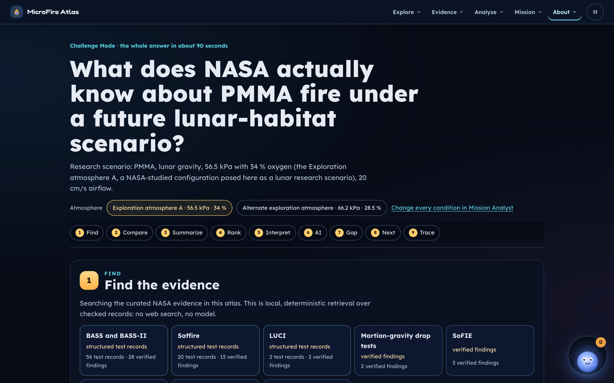</a><br><b>Challenge Mode: one question, nine stages</b><br>A NASA-studied atmosphere posed as a lunar research scenario. Stage 1 shows which evidence families were searched and the role each can play.</td><td width="50%" valign="top"><a href="docs/screenshots/35-challenge-rank.jpg">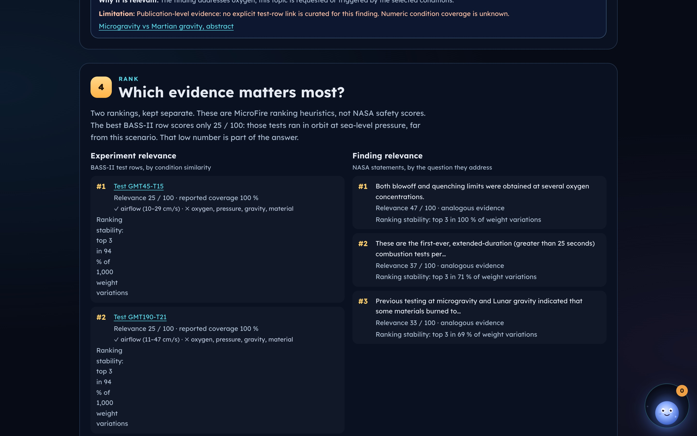</a><br><b>Rank, kept separate</b><br>Experiments and findings are ranked side by side but never merged. Each rank says what matched and what did not.</td></tr>
<tr><td width="50%" valign="top"><a href="docs/screenshots/37-challenge-gap.jpg">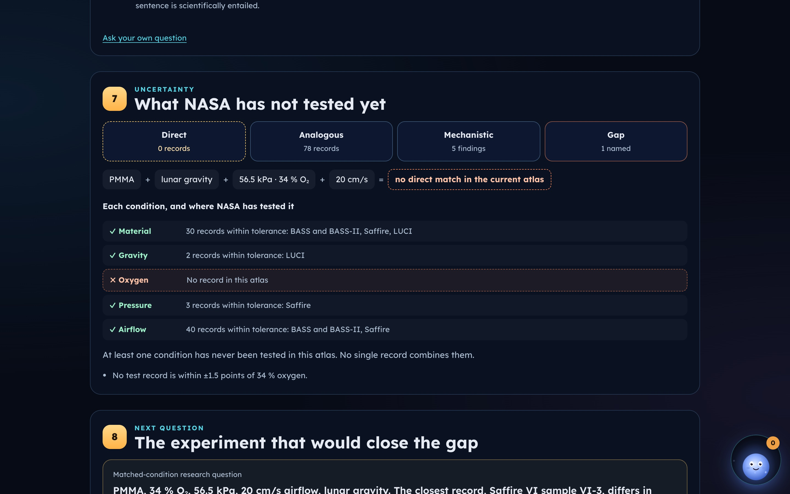</a><br><b>What NASA has not tested yet</b><br>Condition by condition: material, gravity, pressure and airflow were each tested somewhere, but no record reaches 34 % oxygen, and none combines them.</td><td width="50%" valign="top"><a href="docs/screenshots/38-challenge-says-no.jpg">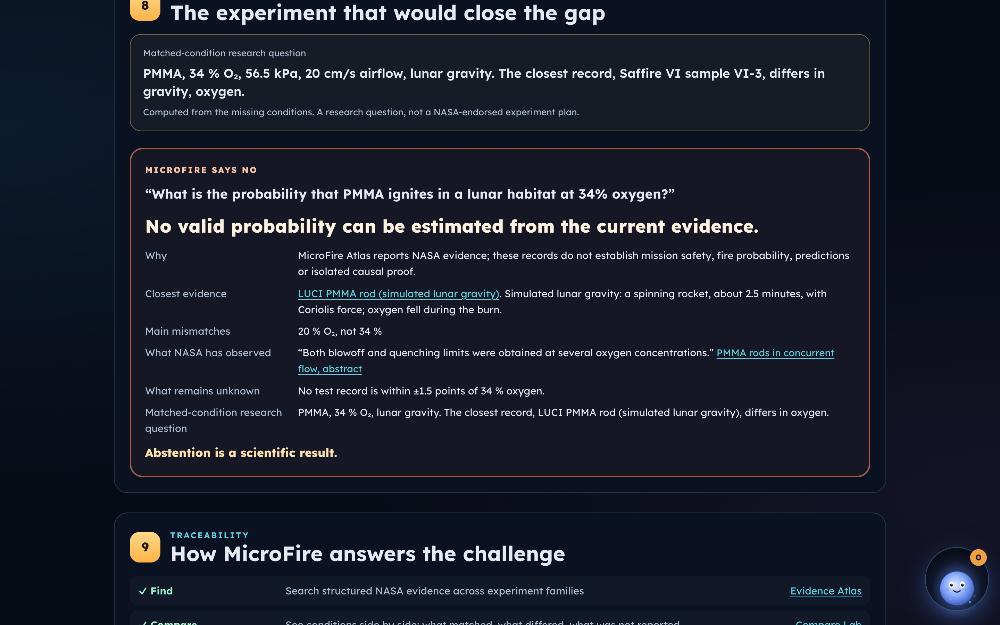</a><br><b>MicroFire says no</b><br>A probability question gets the closest evidence, the mismatches and the open research question. It never gets a number.</td></tr>
</table>

### For young explorers

<table>
<tr><td width="50%" valign="top"><a href="docs/screenshots/01-home.jpg">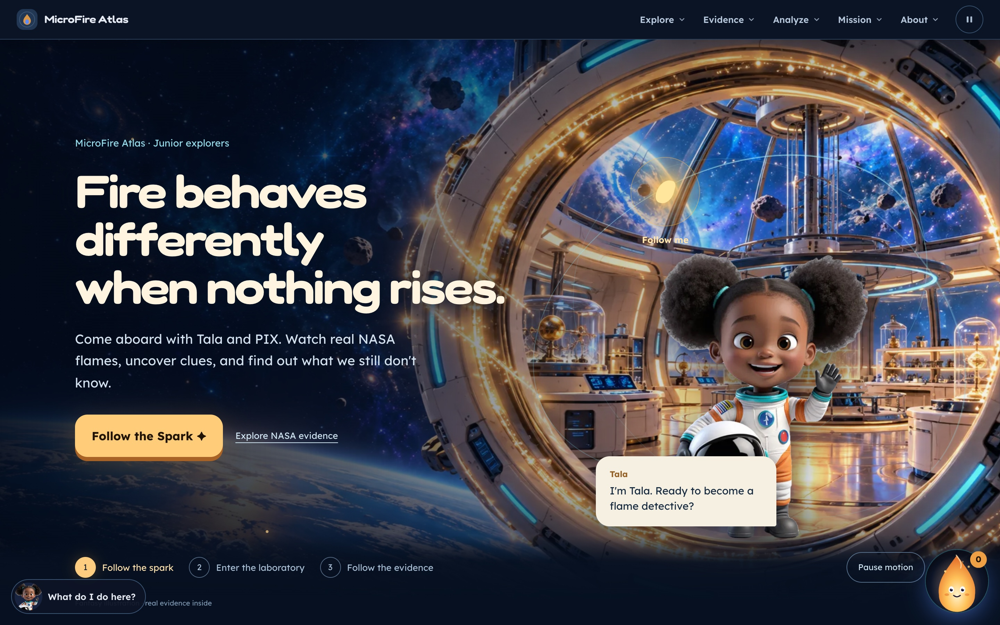</a><br><b>Home: follow the spark</b><br>A scroll journey through three illustrated worlds. Tala and PIX invite children in, and one tap starts the adventure.</td><td width="50%" valign="top"><a href="docs/screenshots/02-freefall-gravity.jpg">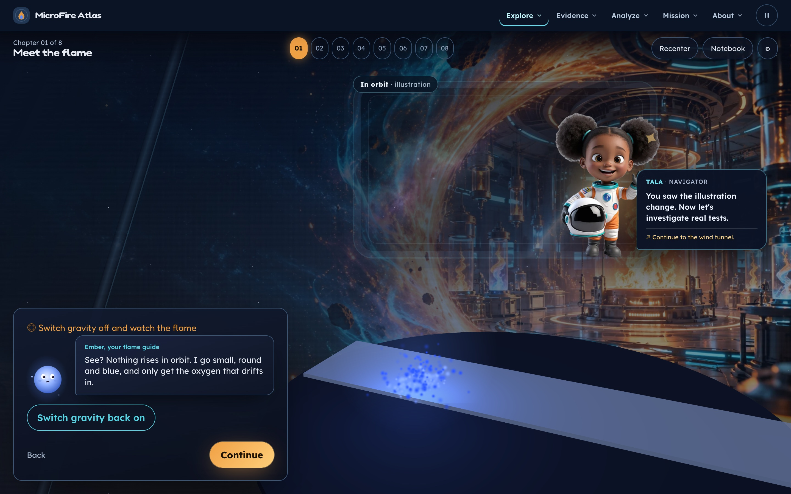</a><br><b>Mission Freefall: switch gravity off</b><br>In the 3D scene the flame stops stretching upward and becomes small, round and blue, fed only by drifting air. It is labelled as an illustration.</td></tr>
<tr><td width="50%" valign="top"><a href="docs/screenshots/03-freefall-build.jpg">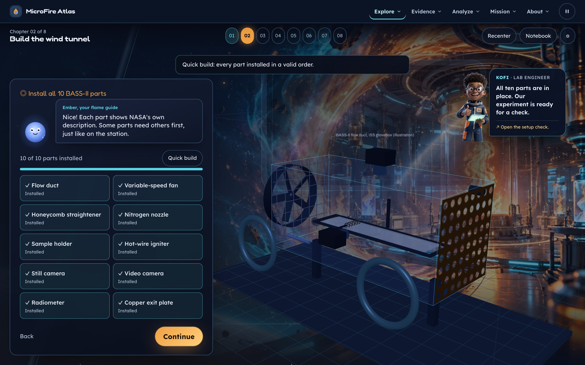</a><br><b>Mission Freefall: build the wind tunnel</b><br>Children assemble NASA's BASS-II flow duct part by part. Each part shows NASA's own description and its PDF page.</td><td width="50%" valign="top"><a href="docs/screenshots/04-expedition-welcome.jpg">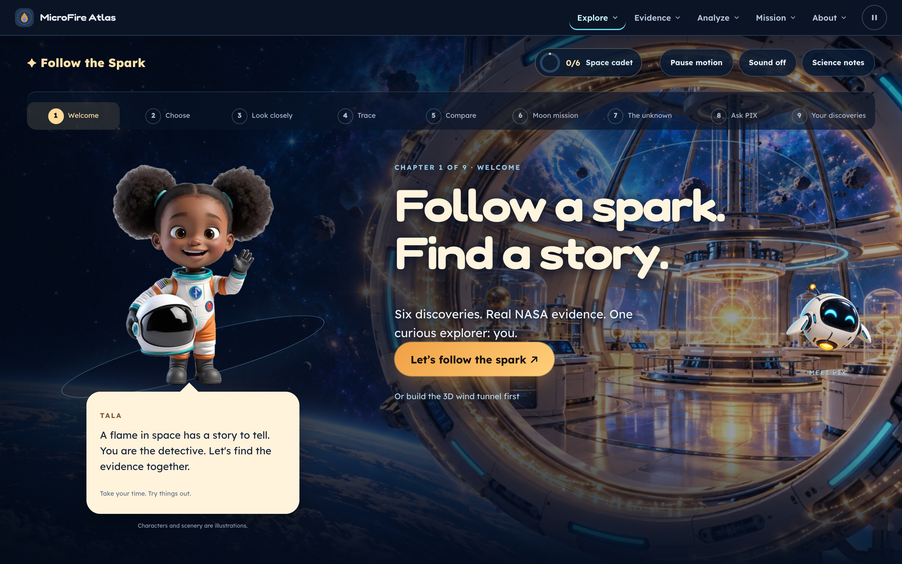</a><br><b>Follow the Spark: welcome</b><br>A nine-chapter map, a crew guide, PIX the evidence robot and a clue meter that tracks the explorer's rank.</td></tr>
<tr><td width="50%" valign="top"><a href="docs/screenshots/05-expedition-vision.jpg">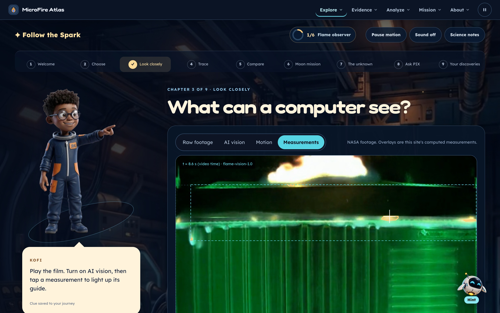</a><br><b>Look closely: computer vision on real NASA film</b><br>A real Saffire film with the computer's outline and measurements, in image pixels. It uses classical OpenCV segmentation, called Flame Vision for children.</td><td width="50%" valign="top"><a href="docs/screenshots/06-expedition-trace.jpg">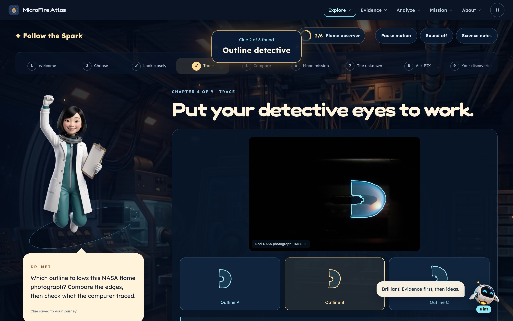</a><br><b>Detective game: find the real outline</b><br>Pick the computer's outline over a NASA photograph. The two practice outlines are labelled as made up. A correct pick lights a clue and raises the rank.</td></tr>
<tr><td width="50%" valign="top"><a href="docs/screenshots/07-expedition-predict.jpg">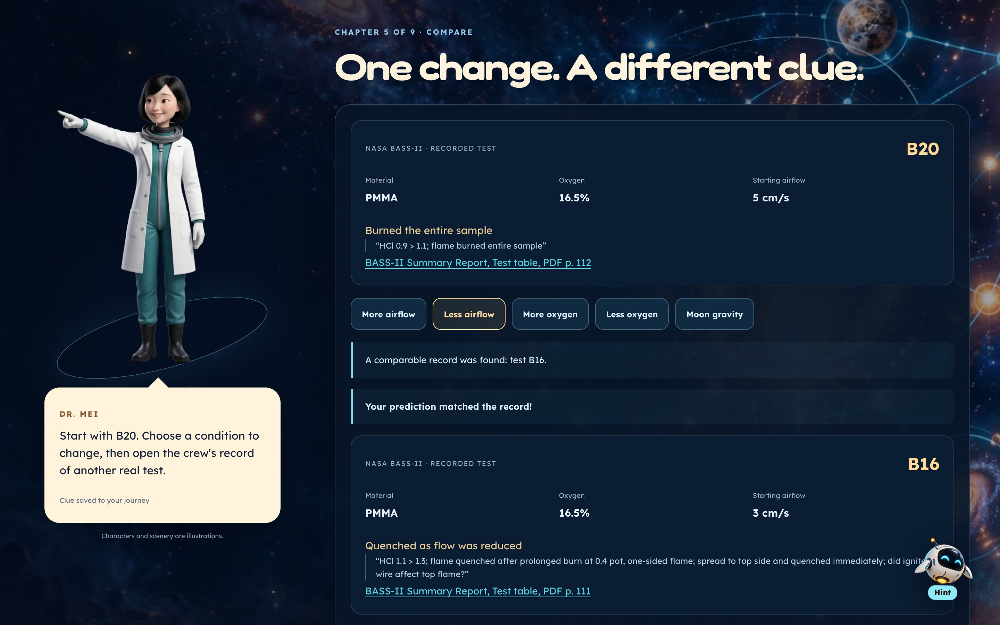</a><br><b>Predict first, then check NASA's record</b><br>Starting from test B20, the child turns the airflow down. The atlas finds test B16 but hides the result until the child predicts. Then NASA's words appear, with PDF page 111.</td><td width="50%" valign="top"><a href="docs/screenshots/08-expedition-moon.jpg">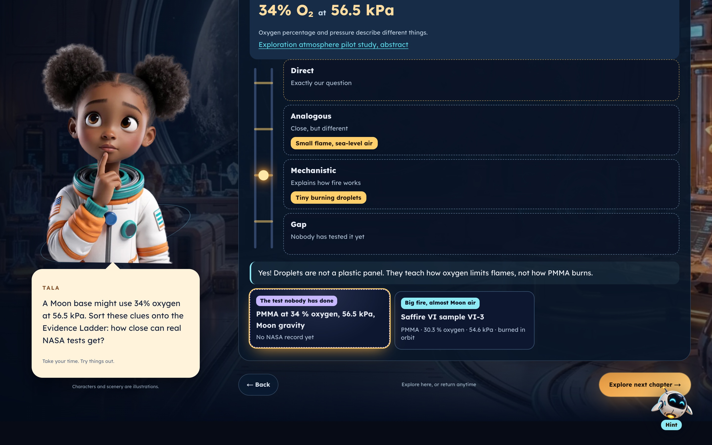</a><br><b>Climb the Evidence Ladder</b><br>For NASA-studied atmosphere A posed at lunar gravity (34 % O₂ at 56.5 kPa), the child sorts four real clues onto the rungs. The right rung for each comes from the atlas's own ladder rules. The top rung stays empty: no NASA test matches yet.</td></tr>
<tr><td width="50%" valign="top"><a href="docs/screenshots/09-expedition-ask-pix.jpg">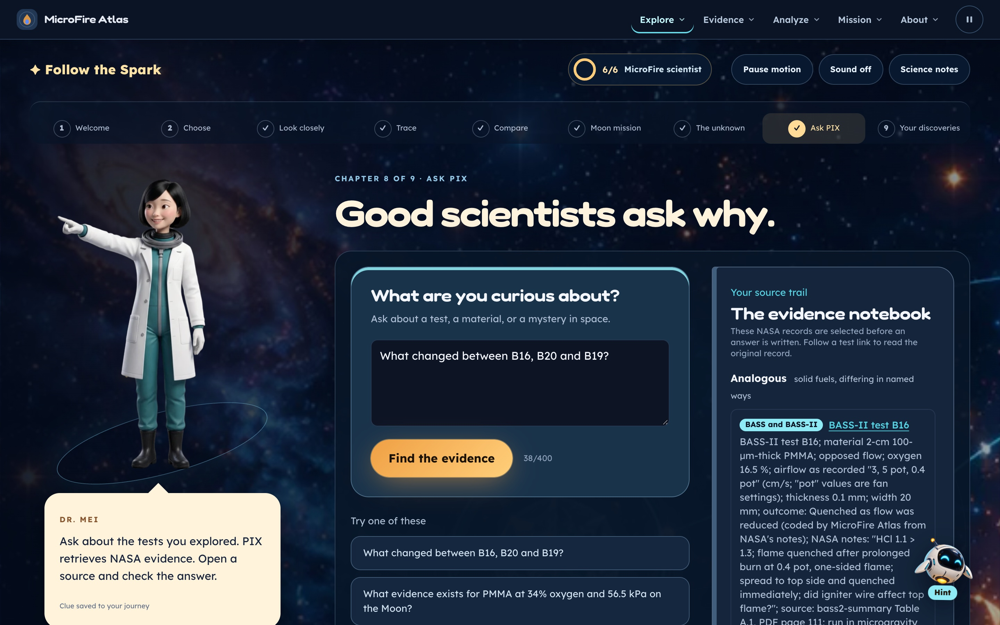</a><br><b>Ask PIX</b><br>Questions are answered from NASA records retrieved first. The evidence notebook shows every source used.</td><td width="50%" valign="top"><a href="docs/screenshots/10-expedition-debrief.jpg">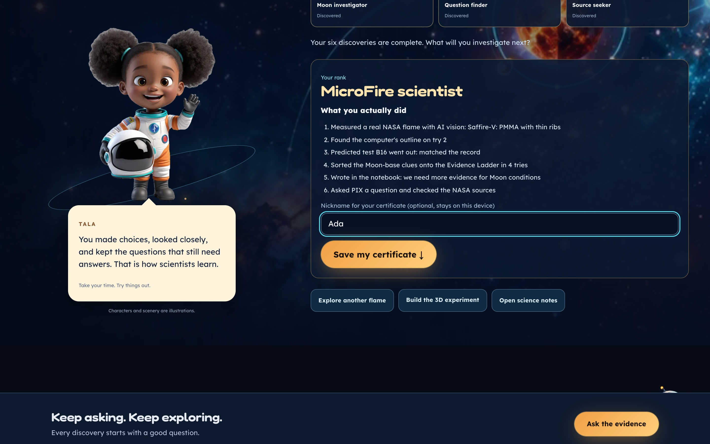</a><br><b>A debrief of real actions</b><br>Instead of a generic score, the debrief lists exactly what this child did, the rank earned and an optional nickname.</td></tr>
<tr><td width="50%" valign="top"><a href="docs/screenshots/11-certificate.jpg">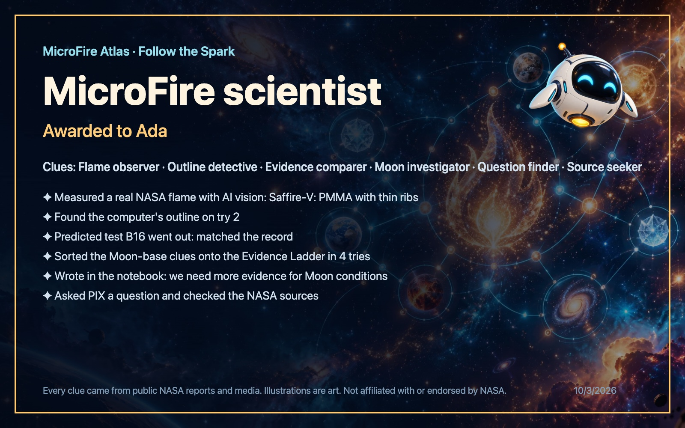</a><br><b>Explorer certificate</b><br>Drawn in the browser from the child's own actions and downloadable as an image.</td><td width="50%" valign="top"><a href="docs/screenshots/18-phone-expedition.jpg">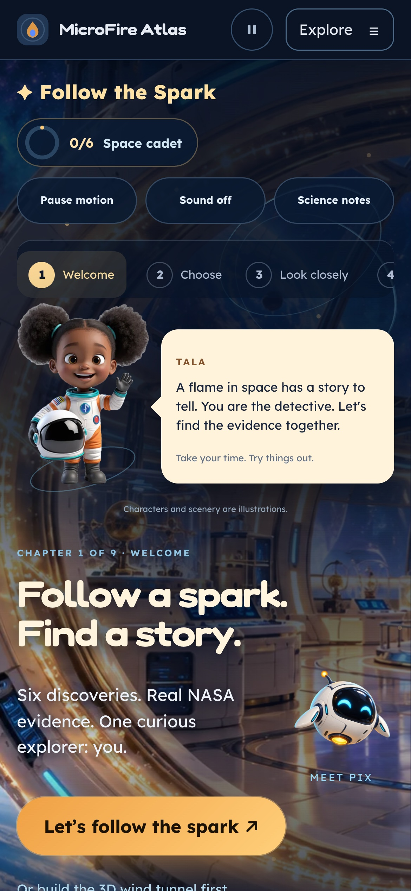</a><br><b>On a phone</b><br>The adventure works on phones too (390 px wide shown).</td></tr>
</table>

### The science underneath

<table>
<tr><td width="50%" valign="top"><a href="docs/screenshots/12-atlas.jpg">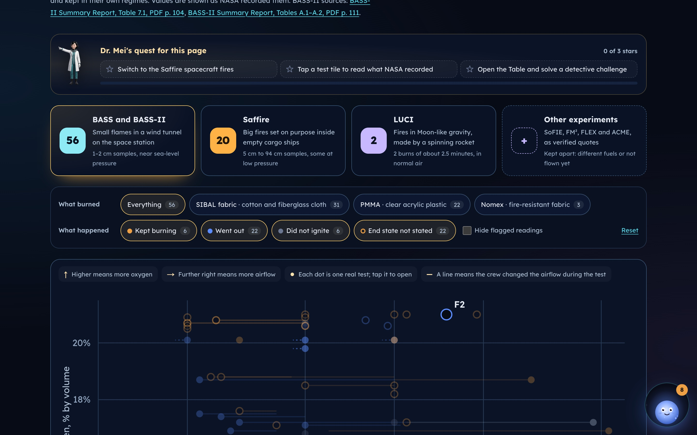</a><br><b>Evidence Atlas</b><br>Three experiment families (BASS-II, Saffire, LUCI) as tiles, plain-language filter chips with counts, a how-to-read strip on every map, and a preview with the crew's own words.</td><td width="50%" valign="top"><a href="docs/screenshots/13-test-record.jpg">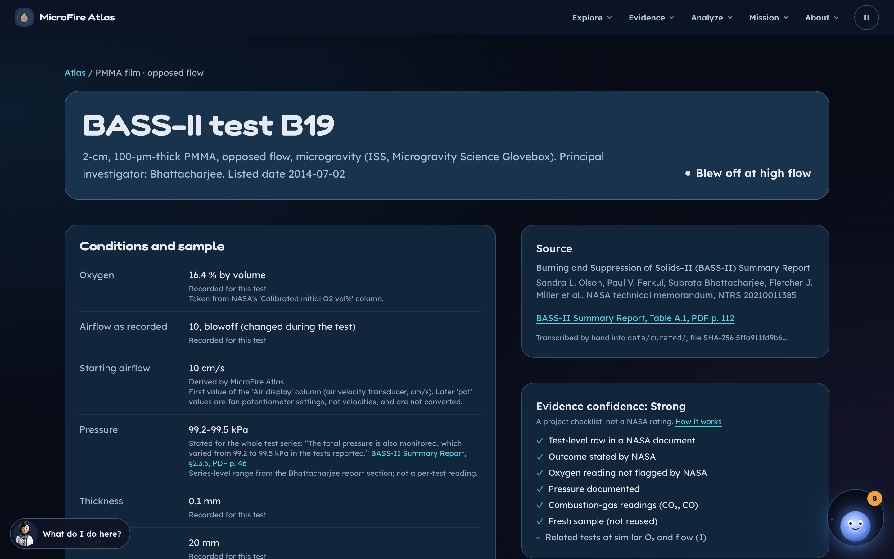</a><br><b>A test record, fully sourced</b><br>Every value is labelled as recorded, stated for the series, derived or not stated. Each record has the crew's verbatim note, the PDF page and an evidence-confidence checklist.</td></tr>
<tr><td width="50%" valign="top"><a href="docs/screenshots/14-compare.jpg">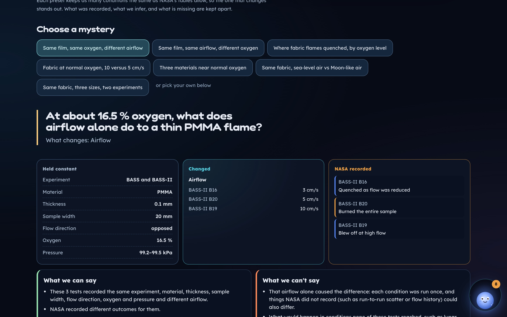</a><br><b>Compare Lab</b><br>Presets hold conditions constant where NASA's tables allow. Here B16, B20 and B19 use the same thin film at 16.4–16.5 % oxygen and differ in recorded airflow.</td><td width="50%" valign="top"><a href="docs/screenshots/15-mission-lab.jpg">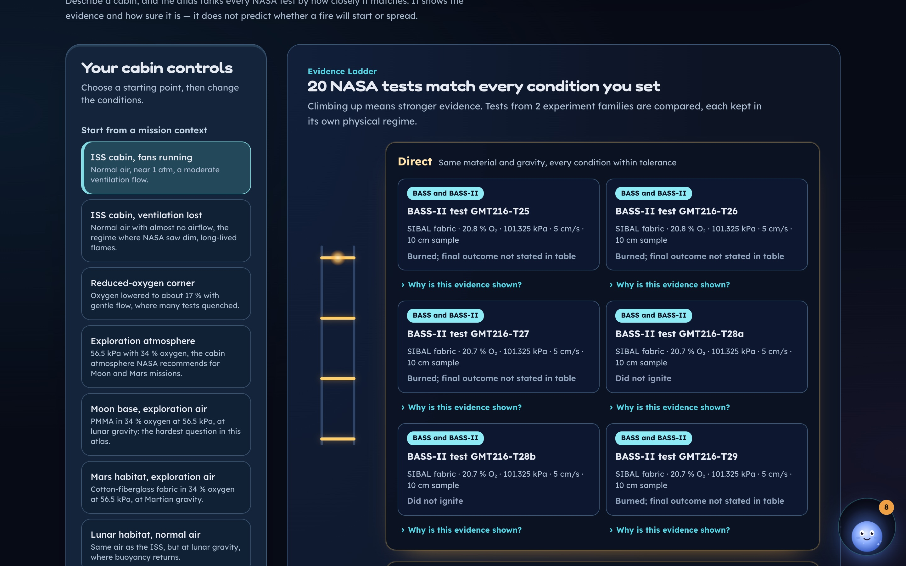</a><br><b>Mission Analyst: the coverage instrument</b><br>Every control sits on top of NASA's evidence: each tick is a real test record, the dashed window is the ladder tolerance. Exploration atmosphere A (34 %) sits in empty space.</td></tr>
<tr><td width="50%" valign="top"><a href="docs/screenshots/16-evidence-gaps.jpg">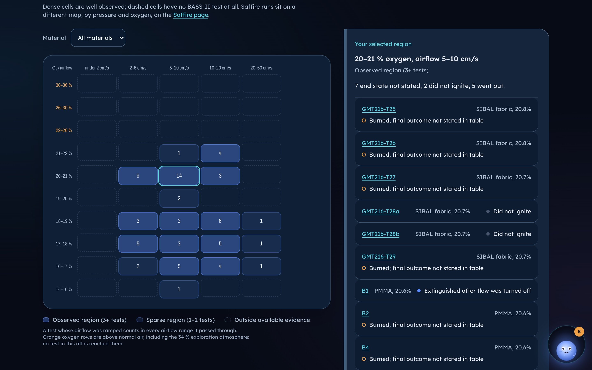</a><br><b>Evidence gaps</b><br>Shows where tests exist and where this atlas has none. A blank region is an open research question.</td><td width="50%" valign="top"><a href="docs/screenshots/17-ask.jpg">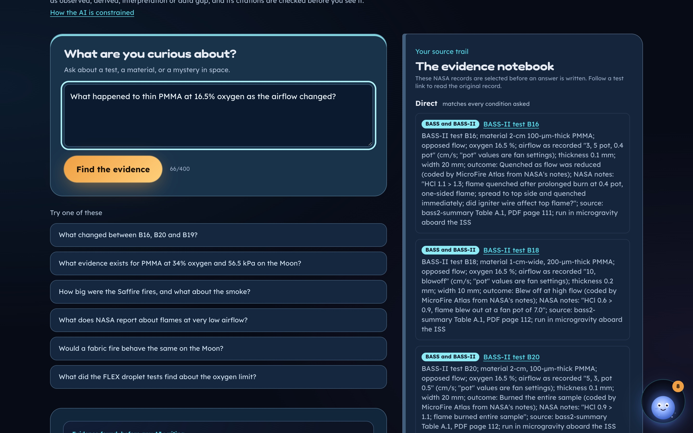</a><br><b>Ask the evidence</b><br>Retrieval picks NASA tests and verbatim quotes first, grouped by rung in the evidence notebook. Until an AI key is added, the page says AI synthesis is coming soon and shows the matched evidence.</td></tr>
</table>

### Evidence intelligence

<table>
<tr><td width="50%" valign="top"><a href="docs/screenshots/19-evidence-ladder.jpg">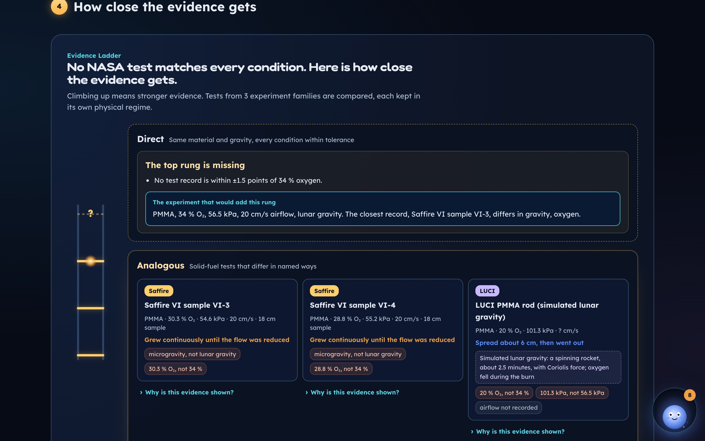</a><br><b>The Evidence Ladder</b><br>Direct, analogous, mechanistic or gap. For a Moon base the top rung is missing, so the atlas names the experiment that would add it.</td><td width="50%" valign="top"><a href="docs/screenshots/20-why-path.jpg">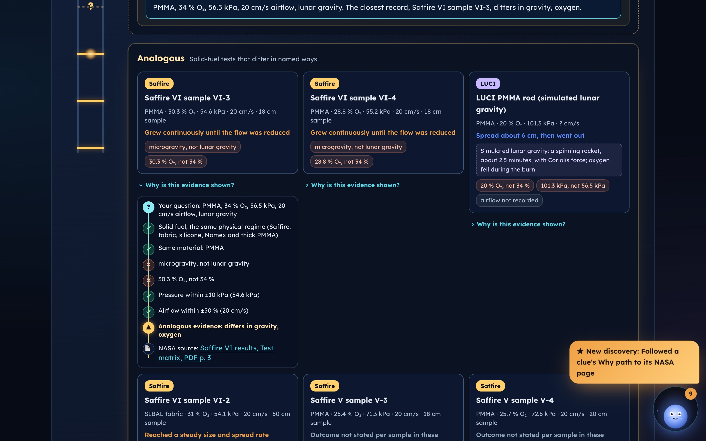</a><br><b>Why is this evidence shown?</b><br>Every card opens a path: your question, each condition matched ✓ or missed ✗, the rung it lands on and the NASA table page.</td></tr>
<tr><td width="50%" valign="top"><a href="docs/screenshots/21-saffire.jpg">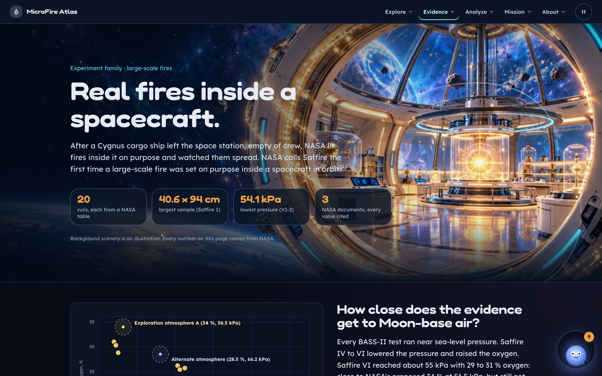</a><br><b>Saffire: real fires inside a spacecraft</b><br>20 runs from the Saffire I–VI experiments, every number traced to its NASA table line, with an atmosphere map against NASA-studied exploration atmospheres.</td><td width="50%" valign="top"><a href="docs/screenshots/22-compare-families.jpg">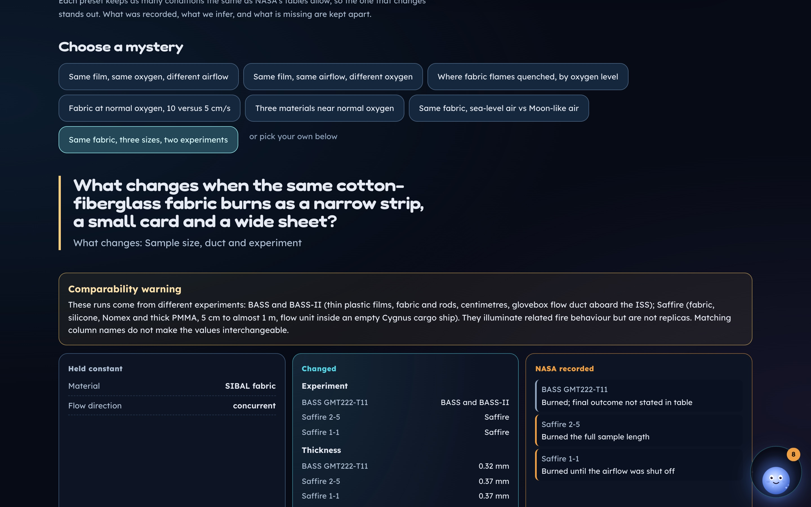</a><br><b>Compare across experiments</b><br>Comparing a BASS strip with Saffire sheets shows a comparability warning. What was held constant, what changed and what NASA recorded stay separate.</td></tr>
<tr><td width="50%" valign="top"><a href="docs/screenshots/23-research-frontier.jpg">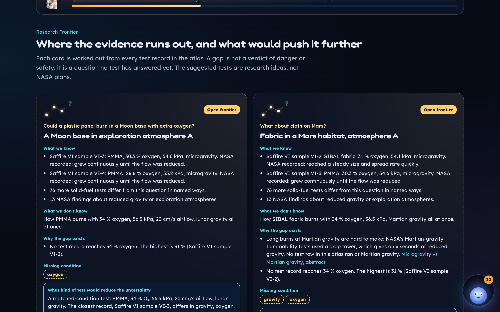</a><br><b>Research Frontier</b><br>For four mission questions: what we know, what we don't, why the gap exists and the matched-condition test that would reduce it.</td><td width="50%" valign="top"><a href="docs/screenshots/24-flame-vision-motion.jpg">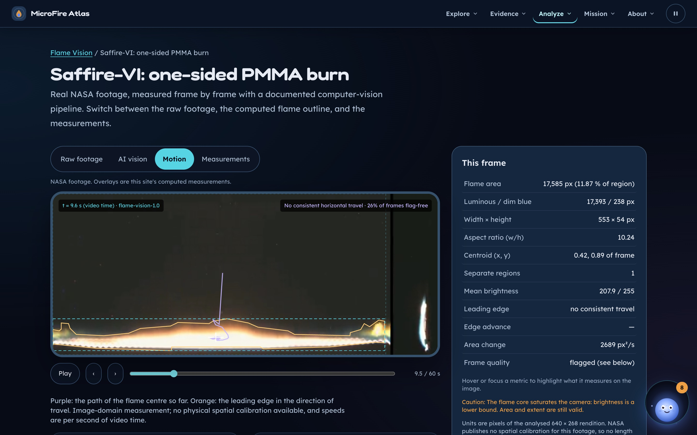</a><br><b>Flame Vision: Motion</b><br>Flame-centre trail, leading edge and area change over time, in pixels. Overexposed frames are flagged instead of measured.</td></tr>
<tr><td width="50%" valign="top"><a href="docs/screenshots/25-tour.jpg">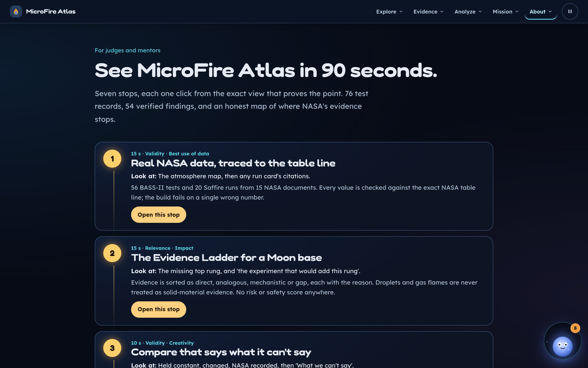</a><br><b>A 90-second tour</b><br>Nine stops of about ten seconds for judges and mentors, each opening the exact NASA evidence behind a point.</td><td width="50%" valign="top"><a href="docs/screenshots/26-open-data.jpg">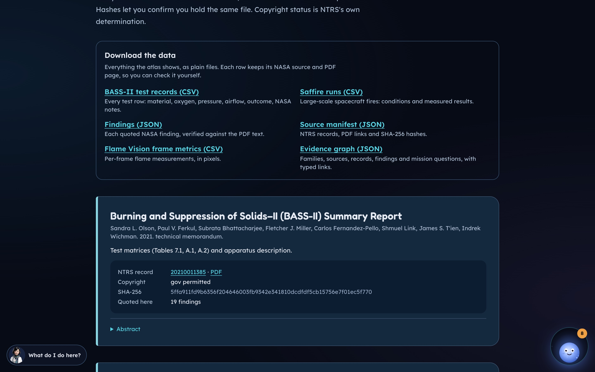</a><br><b>Open data</b><br>Download test records, Saffire runs, findings, the source manifest, frame metrics and the full evidence graph as CSV or JSON.</td></tr>
</table>

### Mission analyst and explorer upgrades

<table>
<tr><td width="50%" valign="top"><a href="docs/screenshots/27-mission-status.jpg">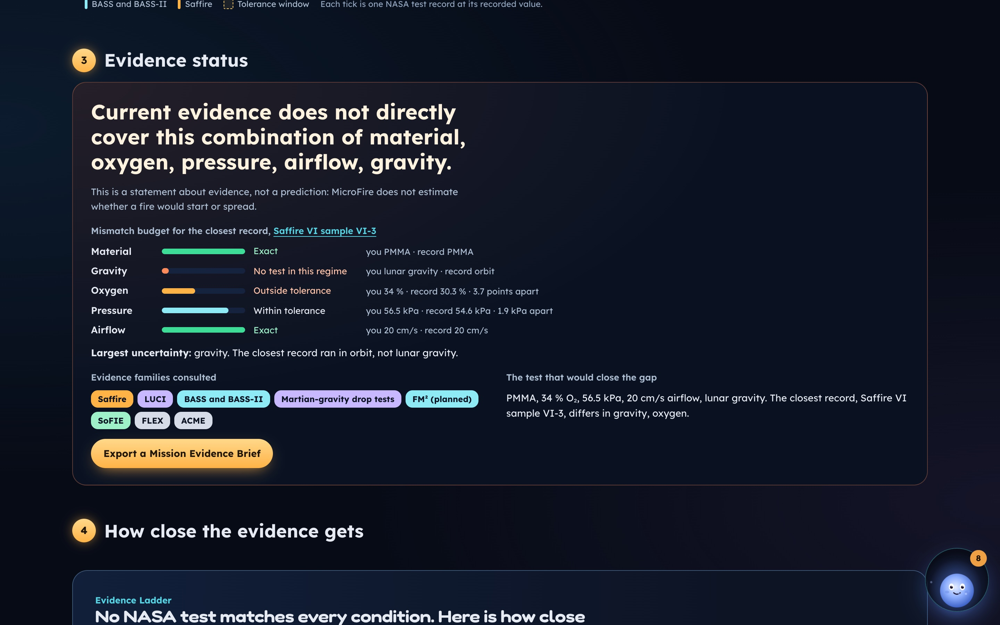</a><br><b>Evidence status and the brief</b><br>A verdict about evidence, never risk, with a mismatch budget for the closest record and a printable Mission Evidence Brief.</td><td width="50%" valign="top"><a href="docs/screenshots/28-atlas-detective.jpg">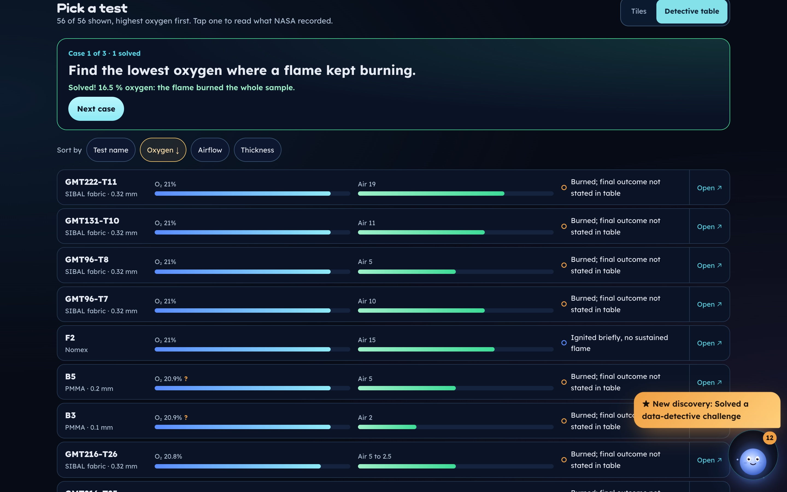</a><br><b>Detective table</b><br>The same NASA rows as a game: sort, then tap the test that answers the case. Answers are computed from the data.</td></tr>
<tr><td width="50%" valign="top"><a href="docs/screenshots/29-luci.jpg">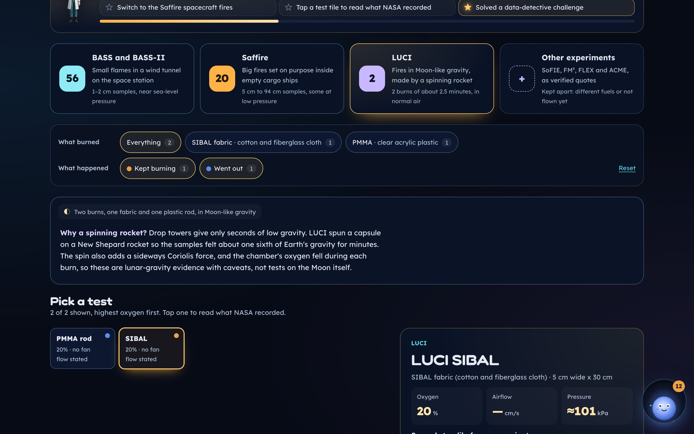</a><br><b>LUCI: Moon-like gravity</b><br>Two burns in lunar gravity simulated on a spinning rocket, every value stored with its NASA sentence and page, always shown with its caveats.</td><td width="50%" valign="top"><a href="docs/screenshots/30-weight-playground.jpg">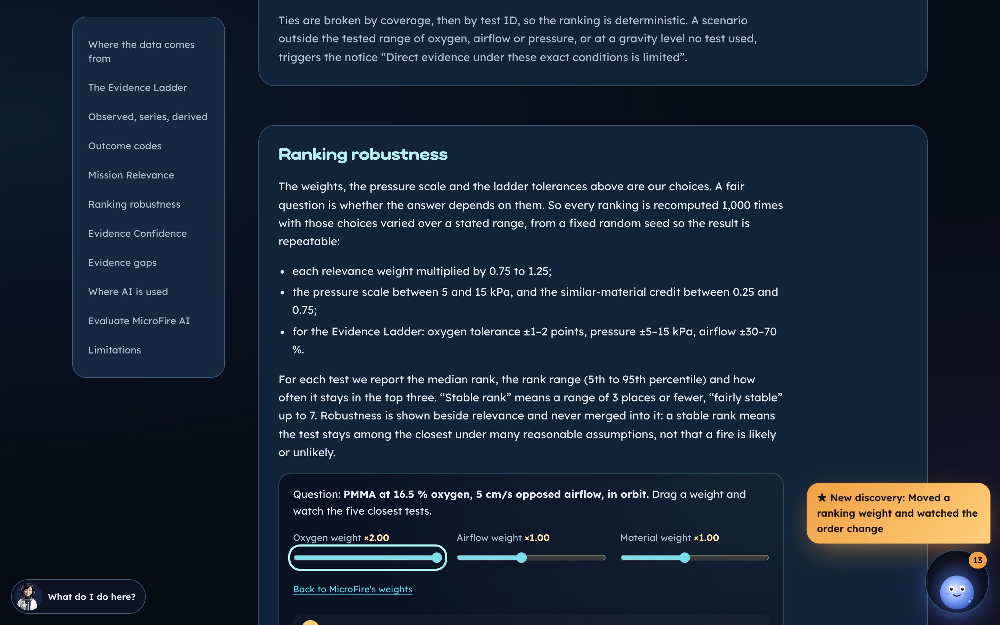</a><br><b>Methodology you can play</b><br>Drag the ranking weights and watch the top tests move; then try to fool the AI claim checker. Both run the real code.</td></tr>
<tr><td width="50%" valign="top"><a href="docs/screenshots/31-research-horizon.jpg">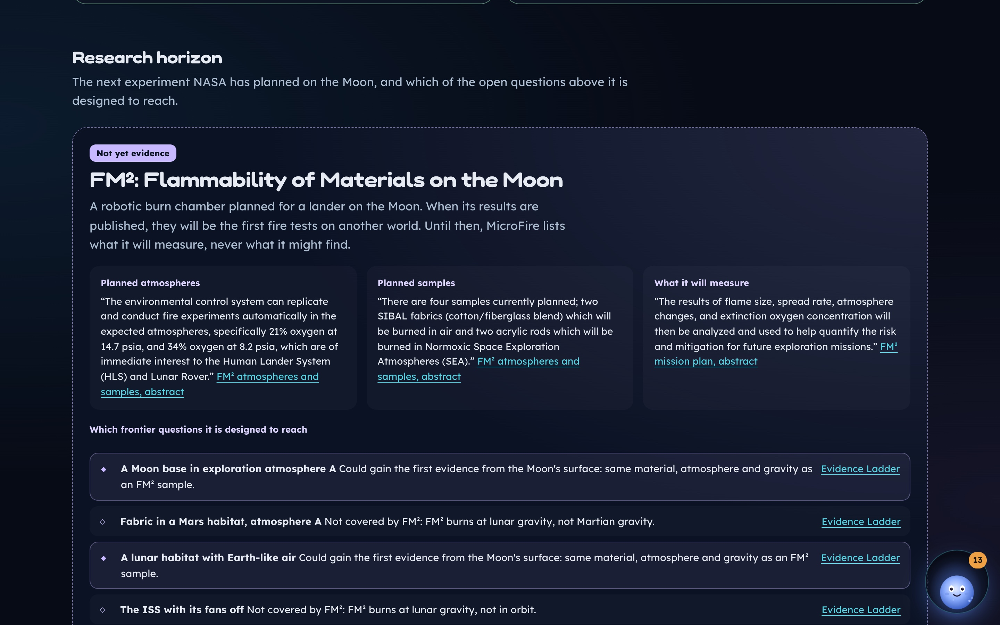</a><br><b>Research horizon: FM²</b><br>NASA's planned burn on the Moon: planned atmospheres, samples and measurements in NASA's words, and which open questions it is designed to reach. No results are invented.</td><td width="50%" valign="top"><a href="docs/screenshots/32-two-ways-in.jpg">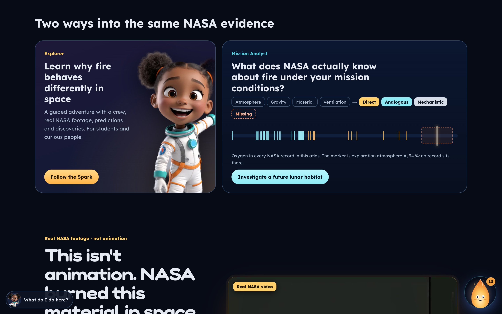</a><br><b>Two ways in</b><br>Explorer for students, Mission Analyst for planners and researchers: the same evidence for both.</td></tr>
</table>

Screenshots are reproducible: `cd docs/screenshots && node shoot.mjs` plays the site and captures each screen.

## NASA data used

| Source (NTRS) | Used for |
|---|---|
| BASS-II Summary Report, NASA/TM-20210011385 | 56 test records transcribed from Tables 7.1, A.1, A.2 |
| BASS-II results (20160000593), BASS thickness study (20140011099) | Verified findings about low-flow flames |
| PMMA rods in concurrent flow (20150008961), SIBAL fabric (20150008962) | Quenching and blowoff findings |
| Effects of Confinement (20205004657) | Saffire vs BASS scale caveat |
| Microgravity vs Martian gravity (20130010991), LUCI (20250010653) | Partial-gravity evidence |
| Exploration atmosphere study (20220009546) | The 56.5 kPa / 34 % O₂ scenario |
| Exploration Atmosphere Tests 3–4 (20240013238) and Test 6 (20260003261) | The alternate 66.2 kPa / 28.5 % O₂ atmosphere |
| LUCI results (20250010653) | 2 lunar-gravity burn records (simulated), each value page-verified |
| FM² posters (20240008623, 20240015307) | Planned lunar-surface burns; SIBAL burning only downward in lunar gravity |
| Saffire I–III, IV–V, VI (20170008805, 20210017780, 20240002981) | 20 large-scale spacecraft fire runs |
| SoFIE, FLEX, ACME (20200000361, 20150023456, 20210015913) | Exploration-atmosphere context; mechanistic droplet and gas-flame evidence |

Run `python3 pipelines/fetch_sources.py` to download every PDF from NTRS. Hashes are in `data/sources.json`. The raw PDFs are not committed.

## FLARE-X gap tracker and change log

A planning document proposed "FLARE-X": a fire-hazard intelligence and counterfactual engine. This section tracks every idea in it against the repository, and records what changed. Statuses are checked against the code, not the plan.

**Rule we kept.** MicroFire never shows a fire-risk percentage, a hazard rating or crew advice. The plan's "Risk: HIGH 87 %" and "31 % risk reduction" mockups are therefore *not* built. Their evidence-bounded equivalent is built instead: an estimate of one experimental outcome, only inside tested conditions, with its uncertainty and its NASA records.

| FLARE-X idea | Status | Where / why |
|---|---|---|
| Common representation across experiments (knowledge graph) | Already built | Typed evidence graph (`/downloads/`), Evidence Ladder ontology. BASS-II, Saffire, LUCI as records; SoFIE, FLEX, ACME as context. |
| Ingest SAME (smoke) and SPICE (diffusion flames) | **Not done** | Needs NTRS PDFs the build environment could not reach. No records were invented. Add through `data/curated/extra_runs.csv` (see `docs/ADD_DATA.md`). |
| Predict ignition, spread, extinction, smoke, overall hazard | Partly | Only "flame established after ignition" is modelled. Spread rate has 4 runs and smoke has no structured table, so neither is modelled. No "overall hazard" by design. |
| Explainability (SHAP-style drivers) | Already built | Exact log-odds contributions for the linear model (Model Lab). **New:** the What-if Lab shows the exact shift per changed input. |
| Evidence-grounded LLM explanation | Already built | `/ask`, with a per-claim checker. |
| Out-of-domain detector | Already built | The Model Lab's domain gate (in / near / out / insufficient). Every What-if state goes through it. |
| **Evidence-weighted envelope** | **New** | `envelope()` in `lib/what-if.ts`: union of the model's 90 % bootstrap interval and a Wilson interval of the raw nearby NASA tests, so it is never narrower than either. |
| **Counterfactual "what if?" simulator** | **New** | `/what-if`. Evidence explorer, not a flame animation: it reports estimates, uncertainty and records, and refuses past the tested range. The visual flame stays on `/lab`. |
| **Intervention comparison** | **New, partial** | Oxygen changes use the model plus record counts. Airflow uses raw record counts only (the deployed model does not use airflow). Suppressant, pressure and compartment isolation are listed as **gaps with no number**. The plan's confidence figures (0.91, 0.87) had no data behind them and were not reproduced. Rows are ordered by evidence, never as advice. |
| **One-scenario decision dossier** (plan: "Mission safety brief" + "what to do next") | **New** | `/dossier`. Joins the gated estimate, the what-if, the gaps and the next test into one page with a shareable link, Markdown download and print. Not a safety verdict: its fifth answer lists what it does not say. |
| **Evidence coverage map** | **New** | Oxygen × airflow grid per material using the gate's own window: 3+ tests, 1–2, none. |
| Fire Safety Gap Finder + next experiment | Already built | `/gaps`, `/next-tests`, `/unseen`. No experimental cost model, so the plan's information-gain ÷ cost ranking is only half there. |
| "Find similar fire" by scenario | Already built | Mission Lab ranking and nearest-test lists. |
| "Find similar fire" by uploaded image or video | **Not done** | Would need server-side vision and a validated similarity measure; the Flame Vision masks are not yet validated against hand annotation. |
| Video computer vision (area, width, height, motion) | Already built | Flame Vision. Growth appears as area change over time, in image pixels. |
| Mission-control look | Not changed | The site's illustrated explorer identity is a deliberate choice. |
| One-click mission safety brief | Already built | `/brief`, `/mission/brief` (an evidence brief, not a safety verdict). The new Scenario Dossier is the integrated version. |
| Experiment timeline | Already built | Explore page. |

### Change log

**2026-10-05: What-if Lab (FLARE-X round 1)**
- Added `apps/web/lib/what-if.ts`: `whatIf`, `interventions`, `envelope`, `coverage`, `wilson`. Pure and deterministic, built on `model-lab.ts` (no model was retrained, no data was added).
- Added `apps/web/lib/what-if.test.ts` (11 tests): an estimate always equals the Model Lab's; per-feature shifts sum exactly to the log-odds change; any change that leaves the tested range blocks the number and ends the comparison; envelopes are never narrower than the model interval; gap rows never carry an estimate; overlapping envelopes are reported as "cannot distinguish"; coverage tiers match the gate; output never uses safe/unsafe/risk-score wording.
- Added `/what-if` (`app/what-if/page.tsx`, `components/whatif/`) and a nav entry under Analyze (`StationMap.tsx`).
- Checks run: 181 TypeScript tests pass, including the project's wording guard over the new UI; lint clean on new files; typecheck clean for new files (existing `e2e/` specs still fail typecheck because `@playwright/test` is not a dependency). The page was rendered and clicked through in a headless browser. A full `next build` could not be run here because Google Fonts is unreachable from the build environment; run it where the network is open.
- Honest limits: the baseline fabric scenario rests on only 3 nearby tests, so its envelope is wide (about 53–100 %); that width is the finding. Everything is ISS microgravity, SIBAL fabric and PMMA only.

**2026-10-05: Scenario Dossier, tour and Challenge Mode integration (FLARE-X round 2)**
- Added `apps/web/lib/dossier.ts`: `parseDossier`, `dossierUrl`, `nearestUntested`, `buildDossier`. No model and no data were added; every number comes from `model-lab`, `what-if`, the Evidence Ladder or `next_experiments.json`.
- Added `apps/web/lib/dossier.test.ts` (11 tests): URL round-trip including gravity and material changes; invalid or hostile URL values are ignored and reported; blocked scenarios carry no estimate in any section or in the Markdown; Earth gravity skips the ladder and says why; the planner pick is always scoped to the five reference cabins; the suggested untested point really has no test nearby; headlines never contradict the lines beneath them; no safe/unsafe/risk-score wording.
- Added `/dossier` (`app/dossier/page.tsx`, `components/dossier/`) and a nav entry under Analyze.
- Judge tour: added two stops (What-if Lab, Scenario Dossier) and re-timed every stop to 10 s, so the tour is nine stops and still 90 seconds.
- Challenge Mode: the brief now links to the Scenario Dossier for the same lunar PMMA question, with a "what would have to change for the evidence to apply" what-if (orbit, 21 % oxygen, 1 atm).
- A bug the tests caught before release: `dossierUrl` wrote `x_gravity` and `x_material` while the parser read `x_g` and `x_m`, so a shared link would have silently dropped any gravity or material change. Fixed and covered by a round-trip test over all five dimensions.
- Checks run: 192 TypeScript tests pass; typecheck clean for new files; the page was driven in a headless browser (copy link reads back the exact URL, the Markdown downloads, the form works, Challenge Mode click-through lands on the dossier, the tour page shows nine stops). A full `next build` still could not run here because Google Fonts is unreachable; run it where the network is open.
- Honest limits: the planner's gain grid is scored against five fixed cabins, so for other scenarios the dossier reports it only as context and relies on its own nearest-untested-neighbourhood computation for the scenario-specific gap.

**Next candidates**: add SAME and SPICE records with citations; validate Flame Vision against hand masks, then consider image similarity; add an experimental-cost field to `/next-tests`; add the What-if Lab and the Scenario Dossier to the methodology page.

## What we implemented

- **Scenario Dossier** (`/dossier`): one scenario in, five numbered answers out, in the order a mission planner asks them: what NASA's tests say here (domain gate, estimate with evidence-weighted envelope, closest tests, Evidence Ladder counts); what happens if one thing changes (the What-if engine and a one-condition comparison); where the evidence is thin or missing (Ladder gaps plus the nearest untested oxygen and airflow neighbourhood); which new test would help most (that neighbourhood plus the research planner's pick, always labelled as scored against five fixed reference cabins, not the user's scenario); and what the dossier does not say. The scenario lives in the URL, so a link reopens exactly the same dossier, and it can be downloaded as Markdown or printed. The edit form is a plain GET form that works without JavaScript; out-of-range URL values are ignored and reported, never trusted. Engine: `lib/dossier.ts`, 11 tests.
- **What-if Lab** (`/what-if`): a counterfactual evidence explorer. Set a starting scenario, change one condition, and see both scenarios side by side: the estimate, an evidence-weighted uncertainty envelope, the gate's domain checks, the closest NASA tests with PDF pages, and the exact log-odds shift each changed input caused. A comparison table changes one condition at a time (oxygen with the model, airflow with raw record counts, suppressant, pressure and compartment isolation as visible gaps), and a coverage map shows where NASA tests are thick, thin or absent. When a change leaves the tested conditions the number disappears and the comparison ends. The estimate is the Model Lab's "flame established" outcome, never a fire-risk probability. Engine: `lib/what-if.ts`, 11 tests.
- **Explore** (`/explore`): one search box over every record and finding that shows matched and missed conditions and the gaps, plus pairs of records that ended differently under near-identical conditions, and a timeline of the NASA sources. Deterministic, no AI.
- **Flame Lab** (`/lab`): a full-screen interactive combustion chamber. Set gravity (Earth, Moon, Mars, orbit), oxygen, airflow, pressure and one of the five materials in the atlas, then run the experiment. Every configuration is classified against the NASA records (direct, close analog, mechanistic only, no matching evidence). The flame is drawn three ways, always labelled: a NASA-observed outcome when a test matches, a conceptual illustration of established physics, or no flame at all ("insufficient experimental evidence"). Explorer and Scientist modes share one engine and the same cited findings. A notebook records every run, including abstentions; Compare checks whether a comparison changes only one setting; four missions, patches, an evidence map and a real-NASA-footage split view.
- **AI Model Lab** (`/model-lab`): evidence-bounded machine learning on 41 BASS-II tests (SIBAL fabric and PMMA). It predicts only whether a flame was established after ignition, because most "went out" labels record the fan-down procedure, not the material. Five models are benchmarked against a baseline with leave-one-crew-session-out validation, bootstrap intervals and a leave-one-material-out stress test; the simplest model that beats the baseline on proper scores is deployed (regularised logistic regression, AUC 0.80, interval 0.60–1.00). A domain gate returns in domain, near domain, out of domain or insufficient evidence, and blocks every lunar, Martian, Earth-gravity, low-pressure or unseen-material query. Full Model Card; `npm run model-lab` reproduces it.
- **Judge Mode** (`/tour`): three one-click demonstrations computed live (ISS low airflow: direct; lunar habitat: analogous; Mars habitat: abstain) and a guided 90-second tour bar that follows the judge across pages. The tour is nine stops of about ten seconds and now includes the What-if Lab and the Scenario Dossier.
- **Combustion Evidence Space** (`/gaps#gaps-tool`): every real record from BASS-II, Saffire and LUCI on oxygen × airflow or oxygen × pressure axes, with the mission condition as a marker and a tolerance box that says "No direct evidence here" when nothing is close.
- **AI trust trace** (`/ask`): question → retrieved NASA evidence → AI synthesis → claims → per-claim checks (citation, number, unit, gravity context, causal wording, prediction) → bounded answer, with each claim's supporting records one click away.
- **Scientific integrity suite**: tests fail the build if a record loses provenance, a referenced finding is missing, an atm conversion is wrong, FM² is shown as completed, LUCI loses its "simulated" label, an unsupported AI probability passes the checker, a lunar or Martian preset gets direct evidence or a model number, or a heuristic is called a NASA score.
- **Challenge Mode** (`/challenge`): the whole challenge brief answered for one lunar-habitat question in nine computed stages, with a deliberate abstention demo and a traceability table (also on `/methodology#challenge`).
- **Finding gold set v2**: 42 hand-labelled finding-ranking cases (34 answerable across airflow, oxygen, pressure, partial gravity, material, scale, detection and smoke, plus 8 unanswerable ones such as "Which material is safest on the Moon?"). Recall@3 0.82, MRR 0.65; 0 forbidden promotions, 0 mechanism-over-solid, 0 context-over-observation; 8/8 abstentions. The first run exposed a real weakness: mission-context questions buried their answers. Ranking v1.1 fixes it without breaking a guardrail. Every finding card now says why it ranks where it does.
- **Fire Safety Matrix**: each fire-safety domain shows its strongest evidence status (structured test data, verified publication finding, context only, planned evidence, not yet curated).
- **Flame Vision annotation tooling**: a 40-frame candidate plan across both Saffire videos and a dev-only tool for drawing human truth masks. No annotations are included yet.
- **Mission Analyst workstation**: atmosphere profiles (ISS-like, exploration A 56.5 kPa / 34 %, alternate 66.2 kPa / 28.5 %), a coverage instrument that draws every NASA record under each control, an evidence-status verdict with a mismatch budget, and a printable Mission Evidence Brief.
- **Ranking robustness**: every ranking is recomputed 1,000 times with the weights, scales and ladder tolerances varied; each test shows its median rank, rank range and top-3 share, beside (never merged with) its relevance.
- **MicroFire-Eval**: 100 frozen questions (lookups, numbers, comparisons, synthesis, mission scenarios, unanswerable and misleading). Before the model: 98/100 pass, gold recall 97 %, 0 over-claims, 70/70 broken claims caught with 0 false alarms. One paid run with gpt-5-mini: citation precision 99.9 %, numeric fidelity 98.0 %, 0 microgravity results told as lunar, 25/25 gaps admitted. Results in `apps/web/eval/`.
- **LUCI**: two lunar-gravity burn records (simulated on a spinning rocket), page-verified; the ladder can now show real lunar-gravity evidence, always with its caveats.
- **Quests**: page quests across the site light stars in an explorer constellation; the Atlas has a detective table and Methodology has two playable explanations.
- **Evidence Ladder**: a combustion evidence ontology sorts BASS-II, Saffire, LUCI, SoFIE, FLEX and ACME evidence into direct, analogous, mechanistic and gap rungs, without merging physical regimes. Every card explains why it is shown.
- **Saffire**: 20 large-scale spacecraft fire runs, verified against the exact NASA table lines.
- **Research Frontier** and **open data downloads**, including a typed evidence graph (JSON).
- **Atlas**: 78 test records in three families (56 BASS-II, 20 Saffire, 2 LUCI), with plain-language filters, test tiles and a detective table.
- **Test pages**: every value is labelled *recorded for this test*, *stated for the series*, *derived by us* or *not stated*, with a link to the PDF page.
- **Compare Lab**: five presets that hold conditions constant where NASA's tables allow. Each separates observed facts, our interpretation, and data gaps.
- **Mission Lab**: ranks tests against a cabin scenario (oxygen, airflow, pressure, gravity, material) with a transparent **Mission Relevance** score and a separate **Evidence Confidence** checklist. It flags scenarios outside the tested range.
- **Flame Vision**: real NASA films and photographs with classical OpenCV segmentation (outline, area, width and height in image pixels).
- **Ask**: citation-checked answers (see below).
- **Methodology** and **Sources** pages generated from the code and manifest.

## Where AI is used

Language-model AI is used only on Ask (and Ask PIX in the adventure, which calls the same endpoint). Flame Vision is classical OpenCV segmentation, not a trained AI model. On Ask, deterministic search first builds an evidence package of tests and verbatim NASA quotes, ordered by Evidence Ladder rung. A language model (OpenAI via `OPENAI_API_KEY`, model set by `OPENAI_MODEL`; Anthropic via `ANTHROPIC_API_KEY` as an alternative) answers only from that package with structured output. Every claim is typed as observed, derived, interpretation or data gap, and is checked:

- citations not in the package are removed;
- numbers must appear in the cited evidence;
- unit mix-ups, microgravity results described as lunar, causal or safety wording, and predictions are flagged.

Without a key, the page says AI synthesis is coming soon and shows the evidence only. Everything else works without AI.

## Scientific methods

- Unit conversion and outcome coding in `pipelines/build_dataset.py`, with tests.
- Every quoted finding is matched against the source PDF or abstract at build time. A misquote fails the build.
- Mission Relevance:

  ```
  relevance = Σ wᵢ·simᵢ / Σ wᵢ
  ```

  - `simᵢ = exp(−|Δ|/scale)`, with scales taken from the data.
  - Missing values count against a test, never for it.

  Weights and scales are shown on `/methodology`.

## Limitations

- 78 test records: 56 BASS-II tests (thin samples, near 1 atm, in orbit), 20 Saffire runs (large samples, some at 54–73 kPa, in orbit) and 2 LUCI burns (simulated lunar gravity, normal air). No record comes from the Moon's surface or from Martian gravity, and none reaches 34 % oxygen.
- Flame Vision segmentation has not yet been validated against hand-annotated frames. The candidate frames and the annotation tool are ready, but no human masks exist yet, and none will be invented.
- Many flows ended at fan settings with no recorded velocity.
- Outcome codes are our reading of short crew notes.
- Flame Vision measures in image pixels only, and the films are not tied to specific test rows.
- Scores are project heuristics, **not NASA ratings or fire-risk predictions**.

## Run it

```bash
python3 pipelines/fetch_sources.py   # download NASA PDFs (needs pdftotext)
python3 pipelines/build_dataset.py   # build + verify data into apps/web/data
python3 -m unittest discover tests   # data tests

cd apps/web
npm install
npm test            # ranking, gaps, presets, citation-check tests
npm run typecheck
npm run dev         # http://localhost:3000
```

Optional: set `OPENAI_API_KEY` (or `ANTHROPIC_API_KEY`) in `apps/web/.env.local` to enable AI answers on `/ask`.

## Security

HawkScan (StackHawk) DAST runs against the site and `/api/ask` (`stackhawk.yml`, `openapi.yaml`). The site enforces:

- a strict nonce-based CSP with no `unsafe-inline`;
- anti-clickjacking and `nosniff` headers;
- a JSON-only, input-validated and rate-limited API.

## Demo film

- **Watch:** https://www.youtube.com/watch?v=T9LLWsoYPws
- `film/explorer/` renders the 3:08 explorer film and its thumbnail (see `film/explorer/README.md`):
  - real site footage, rendered frame by frame at 4K and 60 fps;
  - a disclosed AI voiceover;
  - every number checked against the data.
- `film/` builds the original 240-second data film (see `film/README.md`).


## Attribution

All data comes from the NASA Technical Reports Server (ntrs.nasa.gov). NTRS copyright determinations are listed per source on `/sources`. Not affiliated with or endorsed by NASA.

MIT licensed.
